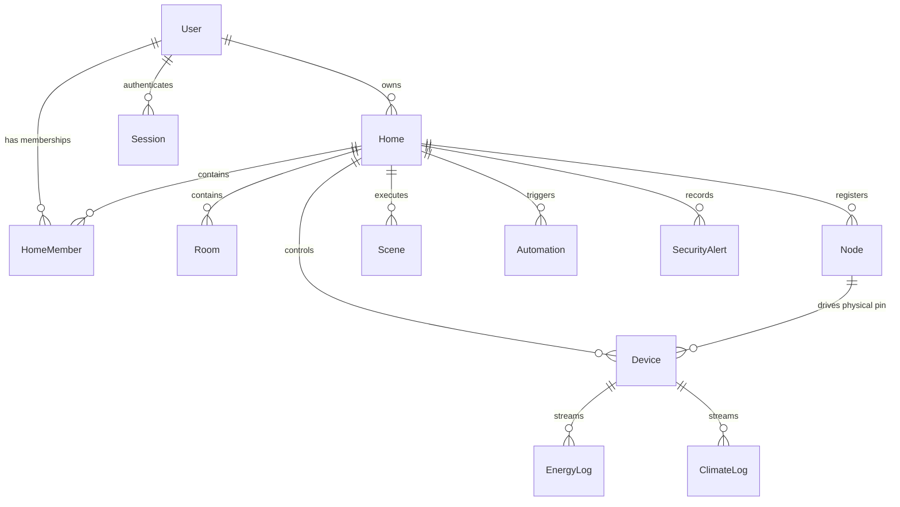

# 🏗️ MOSA SMART PLATFORM — CURRENT ARCHITECTURE REPORT (v3.1)
**Project Owner & Creator:** **MOSA AL-KADHEM**  
**Audit Stage:** Phase 0 — Full Architecture Discovery  
**Date:** August 24, 2026  

---

## 1. System Topology & Directory Structure

```
MOSA Smart Platform/
├── apps/
│   ├── api/                 # Fastify Node.js Backend Server (Port 8080)
│   ├── web/                 # Next.js 14 App Router Frontend & PWA (Port 3000)
│   ├── relay/               # Edge-Cloud Tunnel / WebSocket Bridge
│   ├── supervisor/          # Background node & watchdog monitor
│   └── mobile/              # React Native Mobile Companion
├── packages/
│   ├── db/                  # Prisma ORM Schema & PostgreSQL Client
│   ├── mqtt/                # Typed MQTT Client & Topic Parsers
│   ├── types/               # Universal DTOs & Action Contracts
│   └── firmware/            # ESP32 Firmware binaries & headers
├── config/
│   ├── mosquitto.conf       # Eclipse Mosquitto MQTT Broker config (1883/8883/9001)
│   └── acl.conf             # Mosquitto Access Control List
├── monitoring/
│   ├── prometheus.yml       # Prometheus Metrics Scraper
│   └── grafana/             # Telemetry & Node Health Dashboards
├── R1_Refactored/
│   └── R1_Refactored.ino    # ESP32 Core Firmware (Relay, Sensors, Mesh)
├── nginx.conf               # Edge Gateway (SSL termination, HTTP->HTTPS, Proxies)
├── docker-compose.yml       # Production Stack Orchestrator
└── docs/audit/              # Forensic Audit Logs & Evidence Reports
```

---

## 2. Infrastructure & Docker Network Architecture

The production environment is orchestrated via Docker Compose within a unified bridge network (`mosa-network`):

| Container Name | Base Image | Internal Port | Exposed Port | Purpose |
|---|---|---|---|---|
| `mosa-nginx` | `nginx:alpine` | 80, 443 | 80:80, 443:443, 8883:8883 | Edge Gateway, TLS termination, Reverse Proxy, Security Headers |
| `mosa-frontend` | `node:20-alpine` | 3000 | (Internal only) | Next.js 14 Dashboard, SSR & Client PWA |
| `mosa-backend` | `node:20-alpine` | 8080 | (Internal only) | Fastify REST API, Socket.IO, Multi-Tenant Engine, AI Engine |
| `mosa-postgres` | `timescale/timescaledb:latest-pg16` | 5432 | 5432:5432 (Dev/Host) | Relational DB + TimescaleDB Hypertables for Telemetry |
| `mosa-mosquitto`| `eclipse-mosquitto:latest` | 1883, 8883, 9001 | 1883:1883, 9001:9001 | MQTT Message Broker for ESP32 Nodes and Sensors |
| `mosa-redis` | `redis:7-alpine` | 6379 | (Internal only) | Token Blacklist, Distributed Locks, Rate Limit Store |
| `mosa-loki` | `grafana/loki:latest` | 3100 | (Internal only) | Centralized Structured Log Aggregator |
| `mosa-prometheus`| `prom/prometheus:latest`| 9090 | (Internal only) | Time-series System Metrics Scraper |

---

## 3. Database Schema & Multi-Tenant Model

The primary tenant boundary is **`Home`**. Every tenant-owned asset is associated with `Home`:



### Multi-Tenant Enforcement Mechanism:
1. **JWT Verification Prehandler (`verifyTenant` in `apps/api/src/lib/permissions.ts`)**: Decodes user and resolves active `homeId` and `role`.
2. **Prisma Client Extensions (`tenantPrisma.ts`)**: Wraps all ORM queries (`findMany`, `findFirst`, `update`, `delete`, `count`) with an automatic `where: { homeId }` filter, blocking IDOR tampering even if a malicious user guesses a foreign UUID.

---

## 4. Authentication & Session Lifecycle

- **Access Token**: Short-to-medium lived JWT signed with HMAC SHA-256 (`fastify.jwt`). Contains `id`, `username`, `role`, `homeId`, `restrictions`.
- **Refresh Token**: 40-byte cryptographically secure random token (`crypto.randomBytes(40)`).
- **Storage**: Stored as SHA-256 hash in PostgreSQL `Session` table.
- **Delivery**: Transmitted in HttpOnly, SameSite=Lax cookie (`refresh_token`).
- **Rotation**: Every call to `POST /api/auth/refresh` invalidates the old session row and issues a new refresh token. Replay of an old token triggers instant 401 rejection.
- **Brute-Force Guard**: `@fastify/rate-limit` enforces a strict 20 req/min limit on `/api/auth/login`.

---

## 5. IoT & MQTT Message Pipeline

1. **Topic Hierarchy**:
   - Device Commands: `mosa/{homeId}/device/{boardId}/command`
   - Device State Broadcast: `mosa/{homeId}/device/{boardId}/state`
   - Sensor Telemetry: `mosa/{homeId}/sensor/{nodeId}/telemetry`
   - Node Status / LWT: `mosa/{homeId}/node/{boardId}/status` (Payload: `ONLINE` / `OFFLINE`)
2. **Access Control (`config/acl.conf`)**:
   - Scoped using dynamic client tokens: `mosa/+/device/%c/#`
   - Device authenticated via client ID and mTLS / password.
3. **Telemetry Ingestion**:
   - `telemetry.processor.ts` consumes incoming sensor topics, validates payload schema, and writes directly to TimescaleDB (`EnergyLog`, `ClimateLog`).
   - Synthetic data generation loops have been removed.

---

## 6. ESP32 Firmware Architecture (`R1_Refactored.ino`)

- **Dual-Core FreeRTOS**: Core 0 handles Wi-Fi, MQTT, WebSockets, and ESP-NOW mesh; Core 1 executes relay actuation, debounce filters, and ADC sampling.
- **GPIO Protection Table**: Strictly rejects boot-strap pins (GPIO 0, 2, 12, 15 on ESP32) to prevent boot strapping failure.
- **Hardware Debounce & Stagger**: 12ms switch debounce with 75ms refractory window; 200ms stagger delay on startup relay restoration.
- **Fail-Safe Mesh (Level 2 Backup)**: ESP-NOW broadcast mesh allows inter-node command forwarding if central Wi-Fi drops.
- **NVS Safe Storage**: Wi-Fi credentials and API keys stored in non-volatile flash via `Preferences.h`.

---

## 7. MOSA Personal AI Pipeline

```
[ User Prompt in Arabic / Iraqi Dialect ]
                    │
                    ▼
[ Arabic Normalization & Tashkeel Stripping ]
                    │
                    ▼
[ Semantic Intent & Dialect Classification ]
(شغل / طفي / بند / شكو مشتغل / كم الحرارة / وضع النوم)
                    │
                    ▼
[ Dynamic Entity Resolution (Rooms, Devices, Scenes from DB) ]
                    │
       ┌────────────┴────────────┐
       ▼                         ▼
[ Single Match: Validated ]   [ Multiple Matches: Ambiguity Check ]
       │                         │
       │                         ▼
       │                 "عندي أكثر من جهاز، أي واحد تقصد؟"
       ▼
[ Security & Tenant Scope Verification ]
       │
       ▼
[ Structured MosaActionContract Emitted ]
       │
       ├─► [ Socket.IO Lifecycle: AI_THINKING -> AI_ACTION_CONFIRMED ]
       ├─► [ PostgreSQL State Update ]
       └─► [ Mosquitto MQTT Command Dispatched to Node ]
```

---

## 8. Summary of Current Status

The current platform is structured as an enterprise IoT system with zero fake telemetry in active runtime. In the following phase, we execute a line-by-line zero-trust audit across all files to uncover any remaining dead code, placeholder routines, or latent vulnerabilities.
